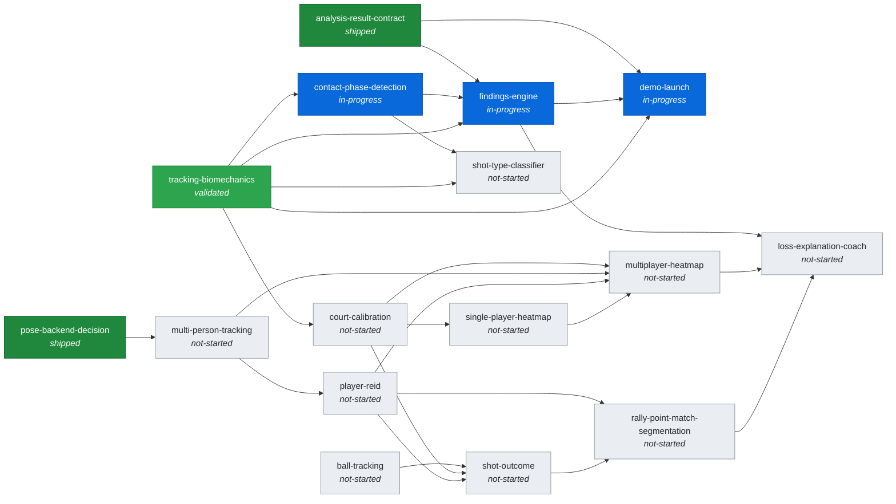

<!-- AUTO-GENERATED by tools/gen_roadmap.py from docs/roadmap/*.md -- do not hand-edit. -->
# Roadmap

Generated from the frontmatter of each node file in `docs/roadmap/`. To change a status or a dependency, edit that node's file and re-run `python tools/gen_roadmap.py`; CI fails if this page is stale. Statuses are claims about the repository, so each node file's prose should cite the evidence behind its status. For what the code actually contains today, see `docs/status_generated.md`.

16 nodes (shipped: 2, validated: 1, in-progress: 3, not-started: 10).

## Dependency graph

An arrow `A --> B` means B depends on A.

## Nodes by status

### shipped (2)

| Node | Depends on | Blocks | Goal |
|---|---|---|---|
| [`analysis-result-contract`](roadmap/analysis-result-contract.md) | - | `demo-launch`, `findings-engine` | A typed, stable output schema for one clip's phase analysis (`AnalysisResult`, `SwingPhases`, `PhaseBoundary`), designed so that downstream consumers never confuse detector output with ground truth. |
| [`pose-backend-decision`](roadmap/pose-backend-decision.md) | - | `multi-person-tracking` | Choose the single-person pose model that production uses, and record the decision and the evidence behind it in the repo. |

### validated (1)

| Node | Depends on | Blocks | Goal |
|---|---|---|---|
| [`tracking-biomechanics`](roadmap/tracking-biomechanics.md) | - | `contact-phase-detection`, `court-calibration`, `demo-launch`, `findings-engine`, `shot-type-classifier` | Single-person pose tracking plus joint angles, kinematics and posture measurements per frame, with explicit per-measurement validity and confidence. |

### in-progress (3)

| Node | Depends on | Blocks | Goal |
|---|---|---|---|
| [`contact-phase-detection`](roadmap/contact-phase-detection.md) | `tracking-biomechanics` | `findings-engine`, `shot-type-classifier` | Detect each swing in a clip, its contact frame, and its phase boundaries (prep, backswing, forward swing, contact, follow-through, recovery) from wrist-speed and rotation kinematics. |
| [`demo-launch`](roadmap/demo-launch.md) | `analysis-result-contract`, `findings-engine`, `tracking-biomechanics` | - | A local upload-and-review demo: upload a clip and see the skeleton overlay, per-frame measurements with their validity, phase output and findings, without reading JSON. |
| [`findings-engine`](roadmap/findings-engine.md) | `analysis-result-contract`, `contact-phase-detection`, `tracking-biomechanics` | `demo-launch`, `loss-explanation-coach` | Deterministic within-player findings: swing-to-swing consistency, left/right asymmetry, and elbow→wrist sequencing. Each finding is a measured number with explicit trust gates, never a narrative or a verdict label. |

### not-started (10)

| Node | Depends on | Blocks | Goal |
|---|---|---|---|
| [`ball-tracking`](roadmap/ball-tracking.md) | - | `shot-outcome` | Per-frame ball position, with confidence, from match footage. |
| [`court-calibration`](roadmap/court-calibration.md) | `tracking-biomechanics` | `multiplayer-heatmap`, `shot-outcome`, `single-player-heatmap` | Map a player's foot and body position from pixel space to real court coordinates through a homography computed from manually clicked court corners and line intersections. Automatic court-line detection waits until manual calibration is proven. |
| [`loss-explanation-coach`](roadmap/loss-explanation-coach.md) | `findings-engine`, `multiplayer-heatmap`, `rally-point-match-segmentation` | - | The capstone: explain why points or matches were lost, in coaching language. |
| [`multi-person-tracking`](roadmap/multi-person-tracking.md) | `pose-backend-decision` | `multiplayer-heatmap`, `player-reid` | Track both players' skeletons in the same clip, including while they occlude each other. |
| [`multiplayer-heatmap`](roadmap/multiplayer-heatmap.md) | `court-calibration`, `multi-person-tracking`, `player-reid`, `single-player-heatmap` | `loss-explanation-coach` | An extension of `single-player-heatmap` to both players, attributing every position to the right player (for example, who controls the T). |
| [`player-reid`](roadmap/player-reid.md) | `multi-person-tracking` | `multiplayer-heatmap`, `rally-point-match-segmentation`, `shot-outcome` | Consistently identify which tracked skeleton is which player through crossings, occlusion and the players leaving the frame. |
| [`rally-point-match-segmentation`](roadmap/rally-point-match-segmentation.md) | `player-reid`, `shot-outcome` | `loss-explanation-coach` | Segment a match video into rallies, points and games, attributing each point to its winner. This is an integration layer over the nodes it depends on, not a new foundational capability. |
| [`shot-outcome`](roadmap/shot-outcome.md) | `ball-tracking`, `court-calibration`, `player-reid` | `rally-point-match-segmentation` | Combine the ball trajectory, the court boundaries and who hit the shot to determine each shot's outcome: winner, error, in or out. |
| [`shot-type-classifier`](roadmap/shot-type-classifier.md) | `contact-phase-detection`, `tracking-biomechanics` | - | Classify shot type (drive, drop, boast, lob, volley, serve and so on, beyond forehand/backhand drives) from existing biomechanics features: the wrist-speed profile, racket-side inference and swing shape. No ball tracking is involved. |
| [`single-player-heatmap`](roadmap/single-player-heatmap.md) | `court-calibration` | `multiplayer-heatmap` | A movement trail and court-position heatmap for one player across a session, in real court coordinates. |
